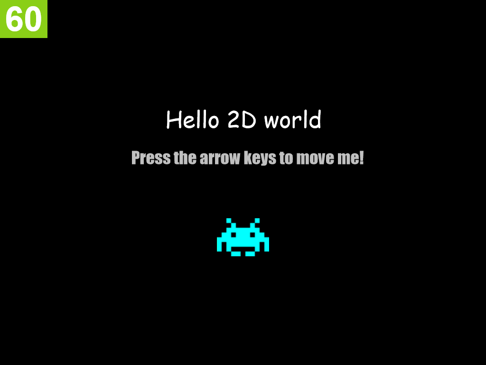

# 2D_Game_Engine

* Compatible with Chrome and Firefox.
* Single JS file (2DEngine.js), no 3rd party libraries required.
* Features:
  * Handles many sprite and text objects
  * Sound effects
  * Animation
  * Physics
  * Gamepad support

## Getting Started
1. Download the files from the master branch.
2. Add your game assets into the existing assets folder.
3. Open MyGame.js in the js folder, and code your game here.
4. Run MyGame.html
5. Enjoy!
